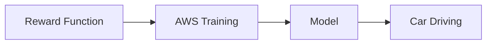

# Architecture Overview

## 1. System Overview
This student project shows how to program AWS DeepRacer behavior with code. It uses a reward function to teach the car what good driving looks like. The code is written in Python, tested locally, and simulated to show learning progress.

## 2. High-Level Architecture Diagram


ASCII fallback:
```
ChatGPT Planning -> Prompt Creation -> Copilot Coding -> VS Code Development -> Testing & Validation -> Simulation Engine -> Results & Output
```

## 3. Technology Stack
- ChatGPT → planning & prompt generation
- GitHub Copilot → coding
- VS Code → development
- Python → implementation
- GitHub → version control
- Simulation scripts → training simulation

## 4. Development Workflow
ChatGPT → Prompt → Copilot → Code → Test → Validate → Simulate

## 5. DeepRacer Programming Model
- The reward function defines desired behavior.
- Training improves performance over time.
- The result is a model that can drive the car.

## 6. Intended Deployment Flow (Conceptual)


ASCII fallback:
```
Reward Function -> AWS Training -> Model -> Car Driving
```

Even though AWS console was not available, this project is built with the same flow in mind.

## 7. Folder Structure Overview
```
ihs-ee-deepracer/
├── README.md
├── reward_function.py
├── train.py
├── tests/
│   ├── test_cases.py
│   ├── test_reward_function.py
│   └── run_phase1_validation.py
├── simulation/
│   └── run_training_simulation.py
├── docs/
│   ├── ARCHITECTURE.md
│   ├── PROJECT_SCRIPT.md
│   ├── PROJECT_SLIDES.md
│   ├── PHASE1_SCOPE.md
│   ├── PHASE1_DEMO.md
│   ├── PHASE1_DEMO_SCRIPT.md
│   ├── PHASE1_SIMULATION_RESULTS.md
│   ├── PHASE1_TEST_RESULTS.md
│   └── PROJECT_ROADMAP.md
└── examples/
    └── phase1_test_cases.json
```
