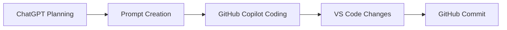

# Title

## What I Did
- 
- 
- 

## How I Did It
- Used ChatGPT to plan the work
- Used Copilot to write or update code
- Used GitHub to save and push changes

## Result
- 
- 

## Diagram

Or as a simple text flow:
ChatGPT → Prompt → Copilot → Code → GitHub

## Next Steps
- 
- 
- 
