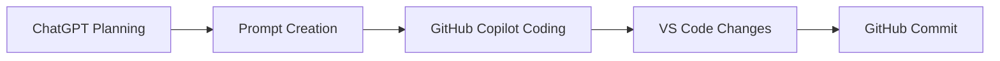

# Phase 1 Setup

## What I Did
- Defined Phase 1 scope
- Reviewed AWS DeepRacer basics
- Set up repo structure
- Started building the reward function

## How I Did It
- Used ChatGPT to plan Phase 1
- Used Copilot to create files and code
- Used GitHub to save and push changes

## Result
- Project scope is clear
- Repo files are organized
- Reward function is in progress

## Diagram

Or as a simple text flow:
ChatGPT → Prompt → Copilot → Code → GitHub

## Next Steps
- Finish reward function logic
- Add local tests
- Update docs for Phase 1
