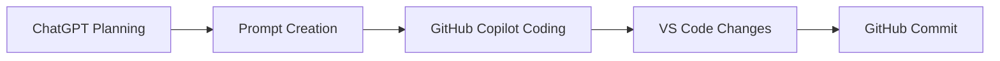

# Phase 1 Complete

## What I Did
- Completed Phase 1 planning, documentation, and implementation
- Built reward_function.py with lane-following logic
- Built local testing using train.py
- Validated multiple driving scenarios
- Organized repository with docs and examples

## How I Did It
- Used ChatGPT to plan Phase 1 and generate structured prompts
- Used GitHub Copilot in VS Code to implement code and documentation
- Iteratively refined code and docs
- Used GitHub commits to track progress

## Result
- Working reward function that encourages lane-following
- Local testing confirms expected behavior
- Repository is structured and demo-ready
- Ready for AWS DeepRacer console or simulation

## Diagram

Or as a simple text flow:
ChatGPT → Prompt → Copilot → Code → GitHub

## Next Steps
- Connect to AWS DeepRacer simulation
- Train model using reward function
- Evaluate performance
- Improve reward logic in Phase 2
