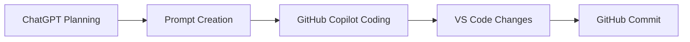

# Phase 1 Testing

## What I Did
- Implemented structured test cases for reward function
- Created validation script to automatically test scenarios
- Ran tests for multiple driving conditions

## How I Did It
- Used ChatGPT to design testing strategy and validation rules
- Used GitHub Copilot to generate test scripts
- Ran validation locally using Python

## Result
- Confirmed reward function behaves as expected
- Different driving scenarios produce logical reward values
- Phase 1 is now validated, not just implemented

## Diagram

Or as a simple text flow:
ChatGPT → Prompt → Copilot → Code → GitHub

## Next Steps
- Move to AWS DeepRacer simulation
- Begin Phase 2 improvements
