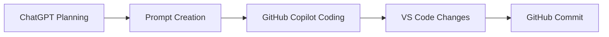

# Phase 1 Simulation

## What I Did
- Created training simulation to mimic AWS DeepRacer learning
- Ran multiple episodes to observe reward improvement
- Generated simulation results

## How I Did It
- Used ChatGPT to design simulation approach
- Used Copilot to implement simulation script
- Reused reward function and test cases

## Result
- Observed increasing reward over episodes
- Demonstrated how reward function guides learning
- Successfully simulated training without AWS console

## Diagram

Or as a simple text flow:
ChatGPT → Prompt → Copilot → Code → GitHub

## Next Steps
- Enhance reward function (Phase 2)
- Improve driving behavior logic
- Prepare final demo
